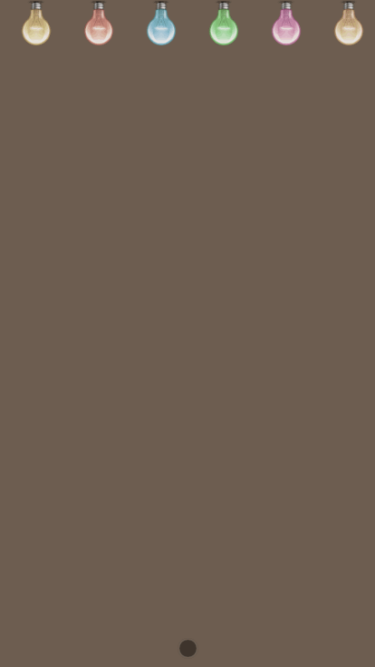

## 生日快乐

> <b>修改config.js的配置就可以为您心爱的人做一个超具创意的网页生日快乐呀,喜欢的话fork or star一下呗~</b>


## TODO
* [x] 每行祝福文字可以配一张图片
* [ ] 配图支持旋转

### config.js 说明
> 温馨提示: 每句话丶每个图片地址丶每个按钮文字的那一行，最后都要以**英文逗号**结尾哦！
```text
var config = {
    // 句子的长度可以任意， 你可以写十句话， 二十句话都可以
    // 每句话尽量不要超过15个字,不然展示效果可能不太好
    texts: [
        "送给我",
        "心爱的小可爱",
        "今天是你的生日",
        "这是我们在一起的",
        "第三个生日了哦",
        "去年的生日",
        "还记得在王婆串串吃的呢",
        "今年要吃好的喽哦",
        "要把我家可爱猪猪喂饱饱",
        "然后抱走",
        "YAMI~~",
    ],
    /**
     * imgs 可以不填, 但是如果要填写的话必须遵循下面的格式
     * "对应上面的文字, 要完全一样" : "图片地址, 可以把图片放在imgs文件夹中"
     * 例如
     * "心爱的小可爱": "./imgs/xiaokeai.jpg"
     *
     * 如果不要图片的话, 直接在每行开头写两个斜杠注释即可, 例如下面的 "今天是你的生日" 的图片就不会展示了:)
     * Tip: 图片最好用正方形or接近正方形, 看起来效果更好
     */
    imgs: {
        "心爱的小可爱": "./imgs/xiaokeai.png",
        // "今天是你的生日": "./imgs/birthday.jpg",
    },
    // 按钮文字描述, 以下是默认的按钮文字，英文的，您可以改成你喜欢的文字
    desc: {
        turn_on: "开始",
        play: "音乐",
        bannar_coming: "颜色",
        balloons_flying: "好像少点东西",
        cake_fadein: "蛋糕？",
        light_candle: "蜡烛？",
        wish_message: "生日快乐",
        story: "A MESSAGE FOR YOU",
    }
};
```


## 截图演示


## 知乎使用教程
[https://zhuanlan.zhihu.com/p/85899661](https://zhuanlan.zhihu.com/p/85899661)

## 结尾
喜欢的话关注一下[霸都丶傲天](https://github.com/ajlovechina)呗~  \
定期更新一下爱情网页模板,简历模板,知识笔记,PDF书籍,原创深度技术分享等 :heart:

* 知乎:[霸都丶傲天](https://www.zhihu.com/people/AJLoveChina)
* Github:[霸都丶傲天](https://github.com/ajlovechina)

## QA
> 如何修改音乐？
> 
> 回答：将你自己的mp3音乐文件覆盖`assets`目录下面的`hbd.mp3`, 記住覆蓋后名字要完全一樣哦！


## 链接
* [第一期:爱情树 🌴将相爱的时刻永远珍藏 （微信，QQ可完美查看）](https://github.com/AJLoveChina/LoveTree)
* [第二期: :cake:改改数据,为心爱的人做一个超具创意的网页生日祝福吧~ (生日快乐)](https://github.com/AJLoveChina/birthday)
* [第三期: :balloon:塞纳河畔，左岸的咖啡。告白气球，飞入我的心扉。](https://github.com/AJLoveChina/loveBalloon)
